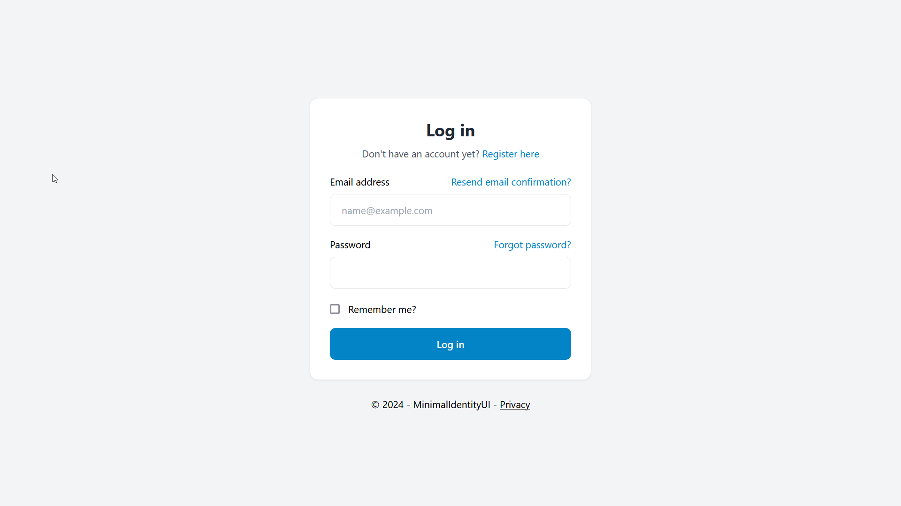
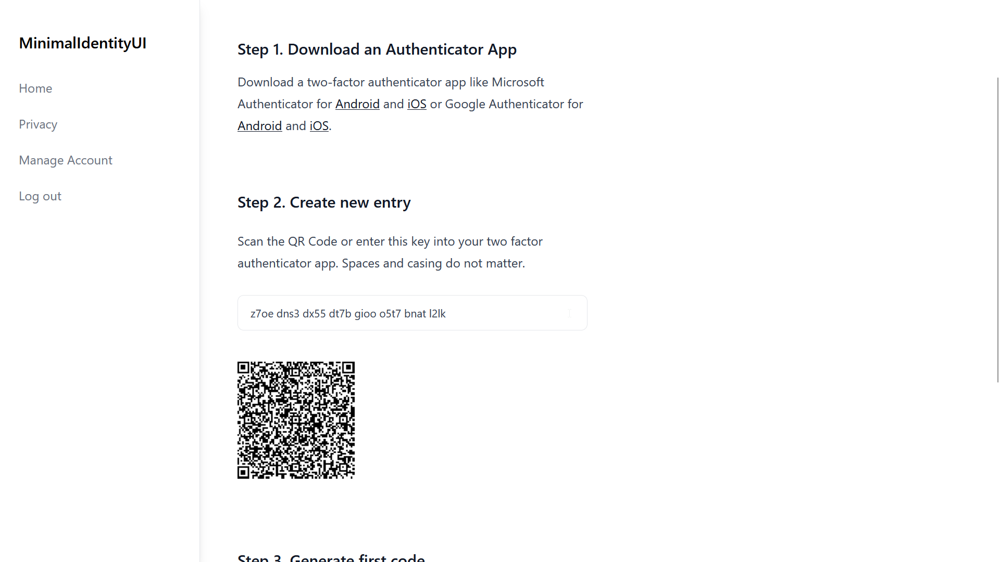

<!-- TOC --><a name="minimalidentityui"></a>
# MinimalIdentityUI
A drop-in replacement for the scaffolded ASP.NET Identity UI based on [Preline](https://github.com/htmlstreamofficial/preline)

## Table of Contents
<!-- TOC start (generated with https://github.com/derlin/bitdowntoc) -->

* [Screenshots](#screenshots)
  + [Clean form style](#clean-form-style)
  + [Account management has a secondary top navigation](#account-management-has-a-secondary-top-navigation)
  + [All Identity UIs have been adapted even the lesser used ones](#all-identity-uis-have-been-adapted-even-the-lesser-used-ones)
  + [Basic App Layout with Side Navbar, Page Title and Footer.](#basic-app-layout-with-side-navbar-page-title-and-footer)
* [Dependencies](#dependencies)
* [Project Goals](#project-goals)
* [Usage in Greenfield projects](#usage-in-greenfield-projects)
  + [1. Setup a default ASP.NET Web App project with the default scaffolded Identity UI](#1-setup-a-default-aspnet-web-app-project-with-the-default-scaffolded-identity-ui)
  + [2. Install TailwindCSS](#2-install-tailwindcss)
  + [3. Copy the MinimalIdentityUI files](#3-copy-the-minimalidentityui-files)
  + [Expected Changes when you add the files](#expected-changes-when-you-add-the-files)
* [Brownfield projects](#brownfield-projects)
* [Contributing to MinimalIdentityUI](#contributing-to-minimalidentityui)
* [Build for Production](#build-for-production)

<!-- TOC end -->

<!-- TOC --><a name="screenshots"></a>
## Screenshots

<!-- TOC --><a name="clean-form-style"></a>
### Clean form style


<!-- TOC --><a name="account-management-has-a-secondary-top-navigation"></a>
### Account management has a secondary top navigation


<!-- TOC --><a name="all-identity-uis-have-been-adapted-even-the-lesser-used-ones"></a>
### All Identity UIs have been adapted even the lesser used ones


<!-- TOC --><a name="basic-app-layout-with-side-navbar-page-title-and-footer"></a>
### Basic App Layout with Side Navbar, Page Title and Footer.


<!-- TOC --><a name="dependencies"></a>
## Dependencies

The project makes use of [TailwindCSS](https://www.tailwindcss.com) and [AlpineJS](https://www.alpinejs.dev).

<!-- TOC --><a name="project-goals"></a>
## Project Goals

- Replace the built-in UI with something a little more modern looking.
- Touch as little of the code-behind in the default scaffolded UI in order to maintain any code changes.
- As few dependencies as necessary (AlpineJS could theoretically be removed and replaced by vanilla JS)

<!-- TOC --><a name="usage-in-greenfield-projects"></a>
## Usage in Greenfield projects

It's easiest to use MinimalIdentityUI if you are starting a new ASP.NET project. 

<!-- TOC --><a name="1-setup-a-default-aspnet-web-app-project-with-the-default-scaffolded-identity-ui"></a>
### 1. Setup a default ASP.NET Web App project with the default scaffolded Identity UI

1. Create a new Visual Studio Project and use the default ASP.NET Web App template and configure authentication to "Individual accounts". 
1. Run the project and ensure the default UI works (just to test the authentication has been setup correctly).
1. Then it's recommended to first scaffold the default built-in UI and commit that change to your version control repository. 

<!-- TOC --><a name="2-install-tailwindcss"></a>
### 2. Install TailwindCSS

With this starting point you can now add Tailwind to your project. You will need a working node and npm installation on your development machine.

Run these three commands in the directory of your web project:
```
npm init
npm install -D tailwindcss @tailwindcss/typography
npx tailwindcss init
```

Then replace the `tailwind.config.js` with the following content (specifically the content and plugins section):

```
module.exports = {
    content: [
        "./Areas/**/*.{cs,cshtml,html,js}",
        "./Pages/**/*.{cs,cshtml,html,js}",
    ],
    theme: {
        extend: {},
    },
    variants: {
        extend: {},
    },
    plugins: [require('@tailwindcss/typography')],
}
```

Then replace the `package.json` with the following content (specifically the scripts section):

```
{
  "name": "your-project",
  "version": "1.0.0",
  "scripts": {
    "tailwind": "npx tailwind -i ./wwwroot/css/site.css -o ./wwwroot/dist/all.css --watch",
    "tailwind:build": "npx tailwind -i ./wwwroot/css/site.css -o ./wwwroot/dist/all.css --minify"
  },
  "devDependencies": {
    "@tailwindcss/typography": "^0.5.10",
    "tailwindcss": "^3.4.1"
  }
}

```

Then replace the `/wwwroot/css/site.css` file with the following content:

```
/*! @import */
@tailwind base;
@tailwind components;
@tailwind utilities;

/* ASP.NET Validation fields set this when valid, so we can hide it */
.field-validation-valid {
    display: none !important;
}
```

*It's recommended to use a .gitignore file that excludes the node_modules folder from your version control.*

In your .csproj file paste the following build target just before `</Project>` to ensure tailwind is built when you compile the project.

```
<Target Name="Tailwind" BeforeTargets="Build">
	<Exec Command="npm run tailwind:build" />
</Target>
```

*For local development you just run `npm run tailwind` to run the tailwind compiler and keep it watching for file changes.*

<!-- TOC --><a name="3-copy-the-minimalidentityui-files"></a>
### 3. Copy the MinimalIdentityUI files

The replacement UI is designed to be a drop-in replacement and will overwrite the default scaffolded files of Identity UI and the Shared layout files.

1. Copy the complete folder structure including all files from the demo ASP.NET project in this repo under `/Areas/Identity` and `/Pages/Shared/` to your project.
1. Use your version control to ensure no unexpected changes were made (see below) and if you're happy run the app and you should see your new UI.


<!-- TOC --><a name="expected-changes-when-you-add-the-files"></a>
### Expected Changes when you add the files

In the Identity Area:
- Every single .cshtml file in the Identity folder has changes.
- ManageNavPages.cs has been modified to add tailwind specific classes instead of `active`.
- There are few additional utility classes (e.g. Classes.cs) that provide common styles.

In the Pages/Shared Layout:
- Overwrites `_Layout.cshtml` and `_LoginPartial.cshtml` and adds a new Layout files.
- These create a basic application layout with a navigation on the left.

<!-- TOC --><a name="brownfield-projects"></a>
## Brownfield projects

For existing projects (assuming you are already using TailwindCSS) it's recommended to copy only the `.cshtml` files and the `Classes.cs` file from the Identity Area. This will have the least impact on your existing code.

A number of Identity UIs require a layout file for an unauthenticated state. This is referenced in the `/Areas/Identity/Pages/_ViewStart.cshtml` file.

```
@{
    Layout = "/Pages/Shared/_LayoutWithoutNavigation.cshtml";
}
```

Change the file to an appropriate layout file in your project.

Further in the `/Areas/Identity/Pages/Account/Manage/_Layout.cshtml` file change the body and top nav part to (removing the TopNav section reference):

```
<partial name="_ManageNav" />
@RenderBody()
```

This will render the management navigation at the top of the page and doesn't require any changes to your primary layout file.

One further change is recommended to enable the active state for this top navigation:
- Adopt the one change (class) made to the `ManageNavPages.cshtml` file.

<!-- TOC --><a name="contributing-to-minimalidentityui"></a>
## Contributing to MinimalIdentityUI

To build tailwind locally and watch for changes in Pages and Areas execute in the root of the web project.
```
npm install
npm run tailwind
``` 

The source file is `wwwroot\css\site.css` and the output file is `wwwroot\dist\all.css`.

To use BrowserLink execute the following in the web directory.

```
dotnet watch
``` 

<!-- TOC --><a name="build-for-production"></a>
## Build for Production

The project has a build target that will execute a NPM script to build and minify the css file.
```
npm run tailwind:build
```
to compile the CSS on build.

